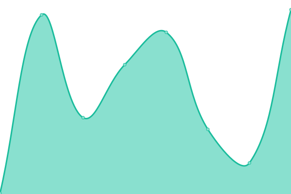

# [📈 Estado en vivo](https://status.droovin.com): <!--live status--> **Todos los sistemas operativos**

This repository contains the open-source uptime monitor and status page for [droovin.com](https://droovin.com), powered by [Upptime](https://github.com/upptime/upptime).

With [Upptime](https://upptime.js.org), you can get your own unlimited and free uptime monitor and status page, powered entirely by a GitHub repository. We use [Issues](https://github.com/droovin/upptime/issues) as incident reports, [Actions](https://github.com/droovin/upptime/actions) as uptime monitors, and [Pages](https://status.droovin.com) for the status page.

## [📈 Live Status](https://demo.upptime.js.org): <!--live status--> **Todos los sistemas operativos**

<!--start: status pages-->
<!-- This summary is generated by Upptime (https://github.com/upptime/upptime) -->
<!-- Do not edit this manually, your changes will be overwritten -->
<!-- prettier-ignore -->
| URL | Estado | History | Tiempo de respuesta | Disponibilidad |
| --- | ------ | ------- | ------------- | ------ |
|  [API](https://api.droovin.com/api/health) | 🟩 Up | [api.yml](https://github.com/droovin/upptime/commits/HEAD/history/api.yml) | 

 314ms
     
 | 

<a href="https://status.droovin.com/history/api">100.00%</a>
    

|  [Admin](https://admin.droovin.com) | 🟩 Up | [admin.yml](https://github.com/droovin/upptime/commits/HEAD/history/admin.yml) | 

 315ms
     
 | 

<a href="https://status.droovin.com/history/admin">100.00%</a>
    

|  [Storefront platform](https://demo-store.droovin.com) | 🟩 Up | [storefront-platform.yml](https://github.com/droovin/upptime/commits/HEAD/history/storefront-platform.yml) | 

 310ms
     
 | 

<a href="https://status.droovin.com/history/storefront-platform">100.00%</a>
    

|  [Landing](https://droovin.com) | 🟩 Up | [landing.yml](https://github.com/droovin/upptime/commits/HEAD/history/landing.yml) | 

 355ms
     
 | 

<a href="https://status.droovin.com/history/landing">100.00%</a>
    

|  [Superadmin](https://ops.droovin.com) | 🟩 Up | [superadmin.yml](https://github.com/droovin/upptime/commits/HEAD/history/superadmin.yml) | 

 233ms
     
 | 

<a href="https://status.droovin.com/history/superadmin">100.00%</a>
    

<!--end: status pages-->

[**Visit our status website →**](https://status.droovin.com)

## 📄 License

- Powered by: [Upptime](https://github.com/upptime/upptime)
- Code: [MIT](./LICENSE) © [Anand Chowdhary](https://anandchowdhary.com), supported by [Pabio](https://pabio.com)
- Data in the `./history` directory: [Open Database License](https://opendatacommons.org/licenses/odbl/1-0/)
